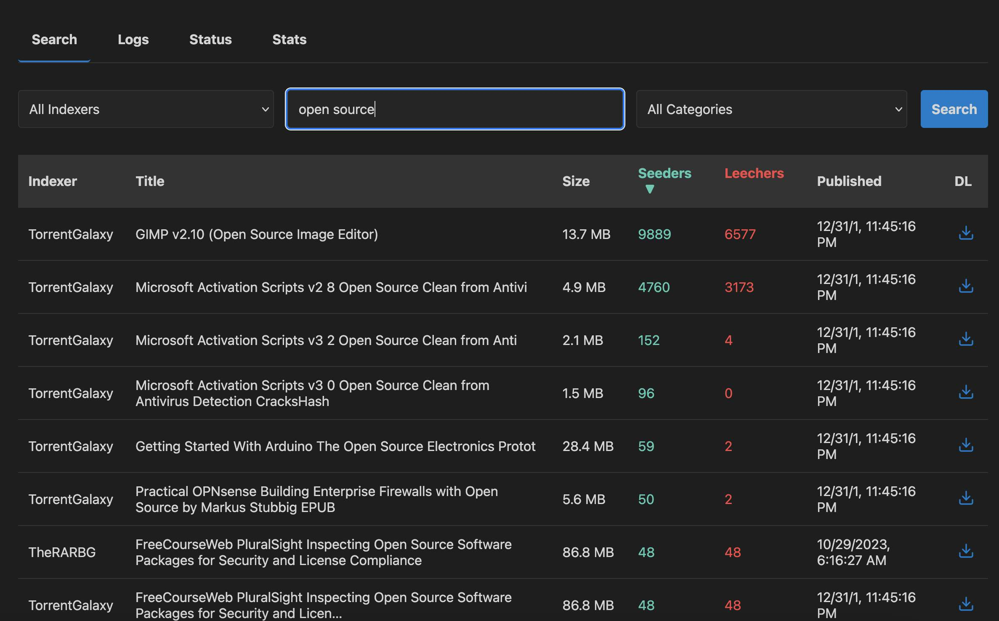

# 🧣 Scarf: Your Personal Meta-Indexer

Scarf is a versatile, self-hosted meta-indexer that acts as a bridge between your favorite media automation tools (like Sonarr, Radarr, Lidarr) and various public and private torrent trackers. 
It provides a clean, unified Torznab API, allowing you to search across multiple sites simultaneously.



## ✨ Features

* **Ultra-lightweight**: It's a single Go binary that usually takes around 10-15 MB or RAM and virtually no CPU.
* **Torznab API**: Provides a standard Torznab feed compatible with most media automation software.
* **Multi-Indexer Support**: Search across multiple public torrent sites at once.
* **Extensible Definition Files**: Easily add or modify indexers using simple YAML configuration files.
* **Web UI**: A simple web interface for manual searching, status checks, and log viewing.
* **Scheduled Caching**: Pre-fetches the latest releases from indexers to provide fast results.
* **Dockerized**: Easy to deploy and manage using the provided `Dockerfile`.
* **Secure**: Protect the web UI with a password and secure the Torznab API with a unique key.

---

## 🚀 Getting Started

The easiest way to get Scarf up and running is with Docker.

### Prerequisites

* [Docker](https://docs.docker.com/get-docker/) installed on your system.

### Build and Run

1.  **Clone the repository (or download the files):**
    ```bash
    git clone [https://github.com/pixelotes/scarf.git](https://github.com/pixelotes/scarf.git)
    cd scarf
    ```

2.  **Build the Docker image:**
    ```bash
    docker build -t scarf .
    ```

3.  **Run the container:**
    ```bash
    docker run -d \
      -p 8080:8080 \
      -v $(pwd)/definitions:/app/definitions \
      -v $(pwd)/data:/app/data \
      -e UI_PASSWORD="your_secure_password" \
      --name scarf \
      scarf
    ```

After running the command, Scarf will be accessible at `http://localhost:8080`.

---

## ⚙️ Configuration

Scarf is configured using environment variables. Here are the most important ones:

| Variable            | Description                                                                 | Default                      |
| ------------------- | --------------------------------------------------------------------------- | ---------------------------- |
| `APP_PORT`          | The port the application will listen on.                                    | `8080`                       |
| `DEFINITIONS_PATH`  | Path to the indexer definition files.                                       | `./definitions`              |
| `SKIP_TLS_VERIFY`  | Skip TLS certs verification (highly insecure, use with care).                                       | `false`              |
| `CACHE_ENABLED`         | Enable or disable cache.                                           | `true`                        |
| `CACHE_TTL`         | How long to cache search results.                                           | `15m`                        |
| `LATEST_CACHE_TTL`  | How long to cache the latest releases.                                      | `24h`                        |
| `MAX_CACHE_SIZE_MB` | Maximum cache size in megabytes (minimum 10MB) | '500' |
| `DB_PATH`           | Path to the SQLite database file for the cache.                             | `./data/indexer-cache.db`    |
| `WEB_UI`            | Enable or disable the web UI.                                               | `true`                       |
| `DEBUG`             | Enable debug logging.                                                       | `false`                      |
| `UI_PASSWORD`       | Password to protect the web UI. **Set this!**                               | `password`                   |
| `FLEXGET_API_KEY`   | The API key for accessing the Torznab feed.                                 | (auto-generated 16 chars)    |
| `JWT_SECRET`        | A secret key for signing session tokens.                                    | (auto-generated 32 chars)    |
| `FLARESOLVERR_URL`  | The url pointing to the FlareSolverr service                                |                              |
| `DEFAULT_API_LIMIT` | Default number of results for API clients that don't support pagination.    | `100`                        |
| `ENABLE_CRONJOBS`   | Enables or disables the job that caches the latest tracker releases         | `true`                       |
| `MAX_FAILURES`   | Failure threshold for disabling an indexer. Set to 0 to disable this feature.    | `5`                       |
| `MAX_CONCURRENT_SEARCHES`   | A lower value might reduce memory and cpu usage, but searches might take longer.    | `4`                       |

---

##  Components

### Web UI

Navigate to the address where you're hosting Scarf (e.g., `http://localhost:8080`). You'll be prompted for the password you set with the `UI_PASSWORD` environment variable.

The web UI has three main sections:

* **Search**: Manually search across a single indexer or all of them at once.
* **Logs**: View live logs from the application, useful for debugging.
* **Status**: Check the status of each indexer, test them individually, and get the Torznab URL for Flexget, Sonarr, Radarr, etc.

### Torznab API

To add Scarf to your media automation software:

1.  Go to the **Status** page in the Scarf web UI.
2.  Find the indexer you want to add (or use the "all" indexer).
3.  Click the "Copy Link" button to get the Torznab URL.
4.  In your media automation software, add a new Torznab indexer and paste the URL.

The URL will look something like this: `http://your-scarf-address:8080/torznab/all?apikey=your_flexget_api_key`

---

## 🧩 Indexer Definitions

Scarf's real power comes from its YAML-based definition files. You can find them in the `definitions` directory. Each file defines how to search a specific torrent site.

### Example Definition (`bitsearch.yml`)

This example demonstrates a modern two-step HTML scraper.

```yaml
key: "bitsearch"
name: "BitSearch"
description: "BitSearch is a Public torrent meta-search engine"
type: "public"
enabled: true
language: "en-US"
schedule: "@every 1h"
settings:
- name: use_flaresolverr
  type: checkbox
  label: Use FlareSolverr
  default: 'false'
search:
  type: "html"
  urls:
    - "[https://bitsearch.to/search?q=](https://bitsearch.to/search?q=){{.Query}}&sort=seeders&order=desc"
  results:
    rows_selector: "div.space-y-4 > div.bg-white > div.items-start"
    # This selector is for the second step: finding the magnet link on the details page.
    download_selector: "a[href^='magnet:?xt']@href"
    fields:
      title:
        selector: "h3 > a"
      # This tells the app where to go for the second step.
      details_url:
        selector: "h3 > a@href"
      size:
        selector: "div.flex.flex-wrap > span:nth-child(2)  i.fas.fa-download ~ span"
      seeders:
        selector: " div.flex.flex-wrap  span.text-green-600 > span:nth-child(2)"
      leechers:
        selector: " div.flex.flex-wrap  span.text-red-600 > span:nth-child(2)"
      publish_date:
        selector: "div.space-y-2 > span:nth-child(3)"
  modes:
    search: [q]
    tv-search: [q, season, ep, imdbid]
    movie-search: [q, imdbid]
    music-search: [q]
    book-search: [q]

category_mappings:
  - indexer_cat: "Movies"
    torznab_cat: 2000
  - indexer_cat: "TV"
    torznab_cat: 5000
```

### Adding a New Indexer
1. Create a new .yml file in the definitions directory.
2. Follow the structure of the existing definition files to define how to search the new site.
3. Scarf will automatically detect the new file and load it. You don't even need to restart the container!

For more complex sites, you can use the details_url and download_selector fields to perform a two-step search, where Scarf first finds a details page and then extracts the magnet link from that page.

## Tip: Running on low-end devices
Here are some tips for running Scarf in memory-constrained devices:
- Disable the jobs that cache latest releases (`ENABLE_CRONJOBS=false`)
- Indexer definitions are kept in memory, so delete all indexers except the ones you are really going to use (4 or 5)
- Lower the maximum number of concurrent searches (`MAX_CONCURRENT_SEARCHES=2"`)
- If you don't need it, you can disable the web UI (`WEB_UI=false`)
- Disable the debug output (`DEBUG=false`)
- Reduce the cache size (`MAX_CACHE_SIZE_MB=10`)
- As a last resort, disable cache globally to reduce memory usage (`CACHE_ENABLED=false`)

## Roadmap

- [X] Create a simple web ui
- [X] Add authentication
- [X] Add Docker support
- [X] Create basic torznab-compatible api
- [X] Add support for api-based trackers
- [X] Add support for simple html scraping
- [X] Add support for multi-step html scraping (for links in details page)
- [X] Add multi-domain support for trackers
- [X] Add a timeout for the /all endpoint
- [X] Add support for private trackers
  - [X] Add support for trackers with user / password authentication
  - [X] Add dynamic config popup based on tracker-defined settings
  - [X] Add support for sending custom headers
- [X] Add support for FlareSolverr (experimental, untested)
- [X] Add specific search modes (tv, movie, etc.)
- [X] Store the results in a cache
- [X] Automatically disable failing indexers
- [X] Add an statistics tab to the UI
- [X] Make it possible to completely disable the cache
- [X] Limit concurrent searches (configurable via env var)
- [X] Add recent searches to the UI
- [X] Implement custom rate limiting for trackers (currently there's a hardcoded 5 seconds wait between requests)
- [X] Add custom server-side filtering (i.e. "&min_seeders=5" or "&min_size=1GB")
- [X] Add custom server-side sorting (i.e. "&sort=size&order=desc")
  - [X] Make sorting per seeders/desc the default
- [ ] Implement custom timeouts for trackers (curerntly there's a hardcoded 30s timeout for all indexers)
- [ ] Add notifications for health checks (webhooks, pushbullet)
- [ ] Dynamic search modes list for "/all" endpoint (automatically ignore indexers that don't have the requested search modes


